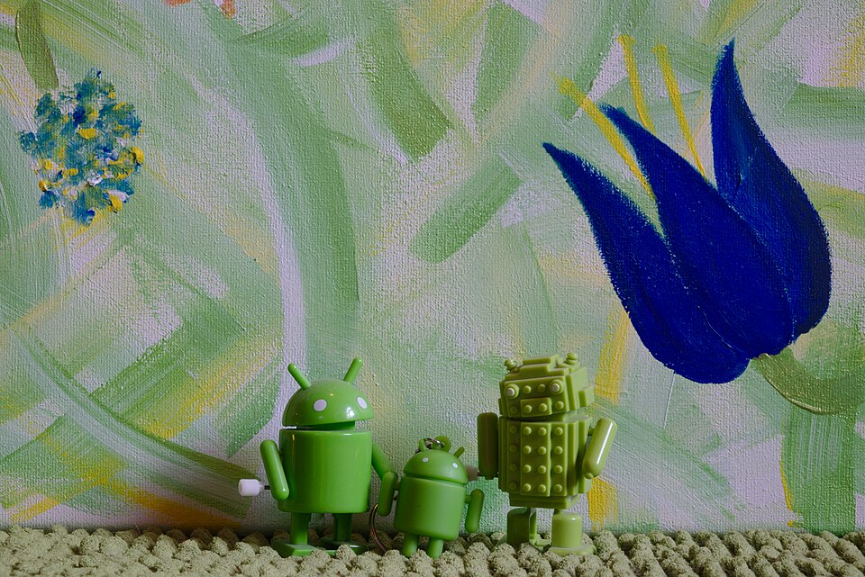
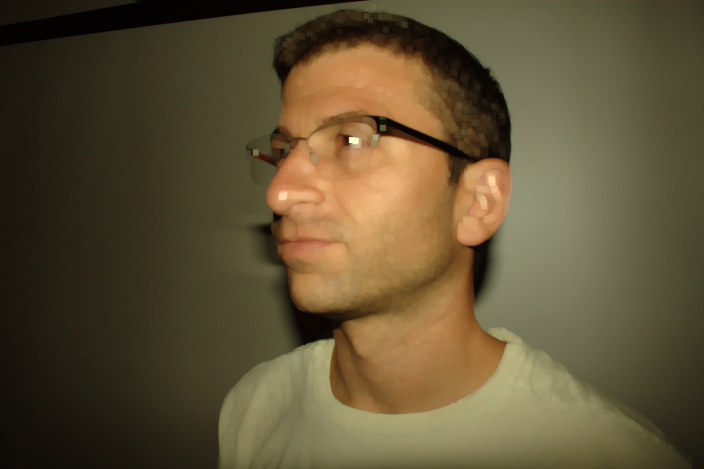

## Описание методов

### 1. Медианный фильтр

* **Что делает:** удаляет шумы (особенно «соль-перец») в изображении, сохраняя края объектов.
* **Ожидаемый эффект:** изображение становится более чистым, шумы убраны, детали объектов сохраняются.
* **Рекомендуемые изображения:**

  * Фото с соль-перец шумом
  * Старые фотографии с небольшим шумом
  * Геометрические фигуры с шумом

  

### 2. Морфологическая обработка

* **Что делает:** изменяет структуру объектов на изображении с помощью структурирующего элемента.
* **Доступные операции и эффекты:**

  * **Эрозия:** уменьшает яркие области, удаляет мелкие объекты/шум.
  
    
  * **Дилатация:** расширяет яркие области, увеличивает объекты, соединяет близкие элементы.

    
  * **Открытие (эрозия → дилатация):** удаляет мелкий шум, сохраняет форму крупных объектов.

    
  * **Закрытие (дилатация → эрозия):** заполняет пробелы и дырки в объектах.

    
* **Рекомендуемые изображения:**

  * Чёткие объекты на фоне (геометрические фигуры, текст)
  * Малоконтрастные объекты
  * Размытые изображения для проверки открытия/закрытия

* **Выводы**

* В медианном фильтре наблюдаем удаление шума на примере картины мазками, контуры становятся более гладкими, детали объектов сохраняются. При эрозии наблюдаем уменьшение площади ярких областей и "сглаживание неровностей", а также появление артефактов, например в тенях. При дилатации наблюдаем увеличение площади ярких областей и "объединение" близких по цвету областей путем, наблюдается небольшое сгалживание.